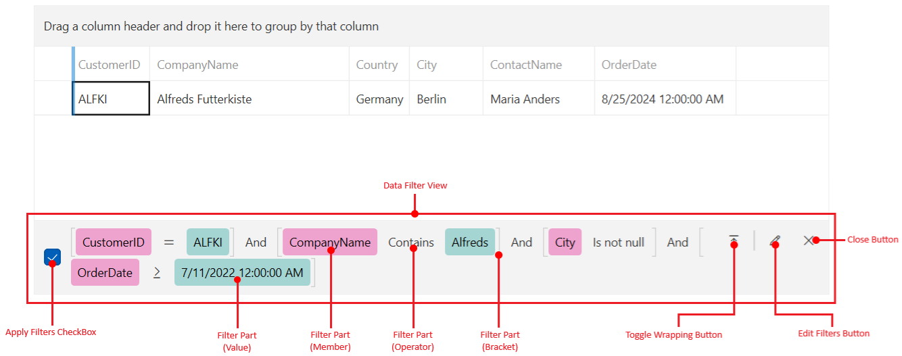
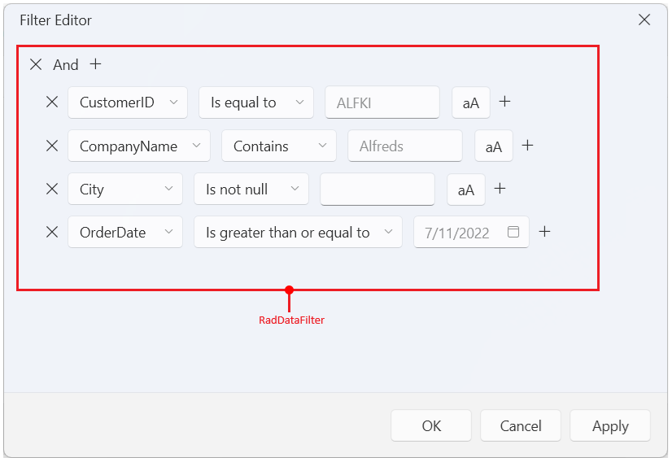
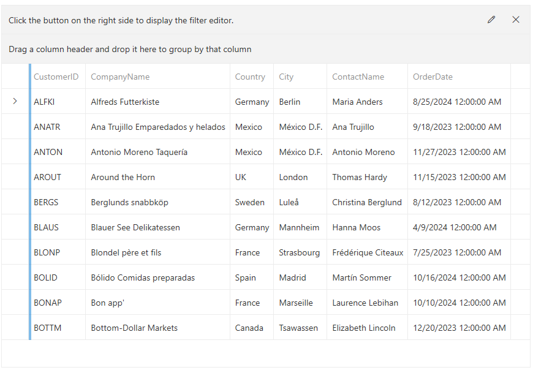
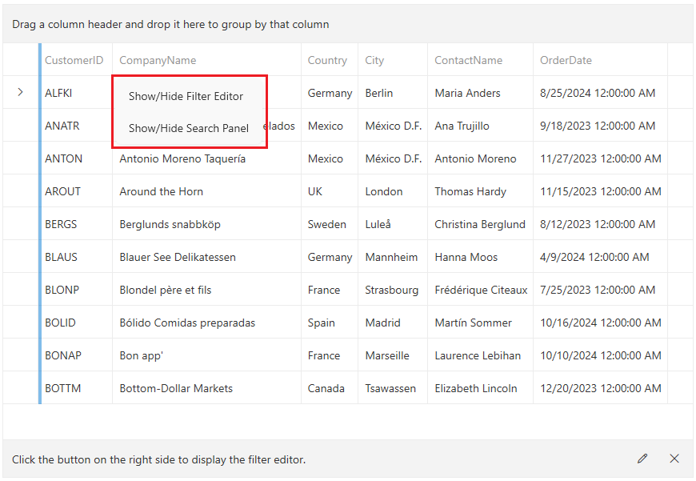
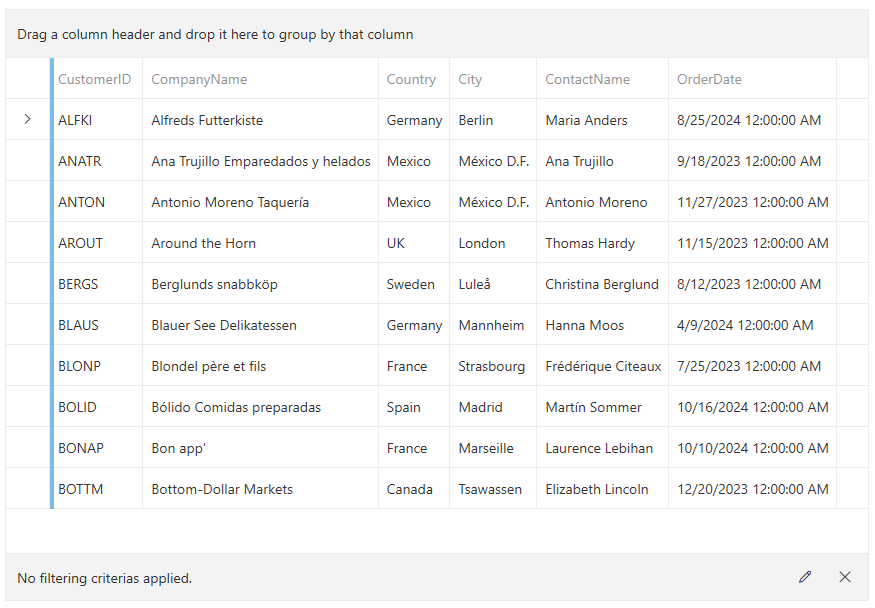
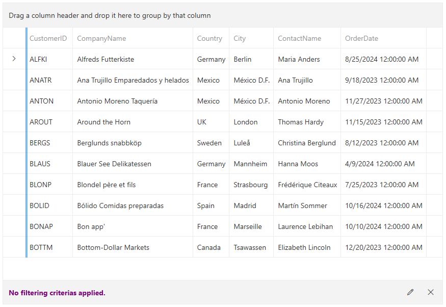
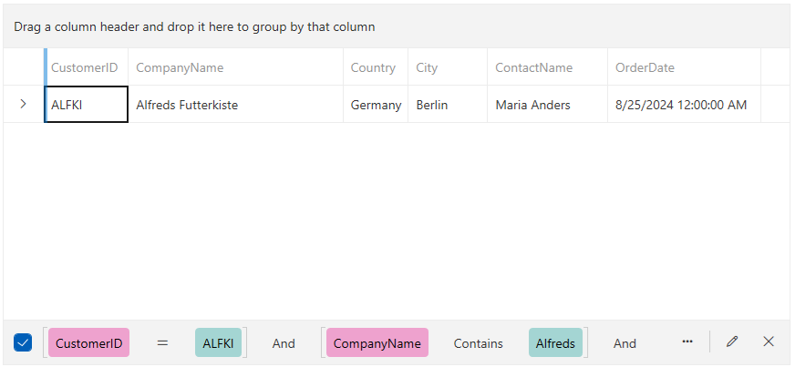
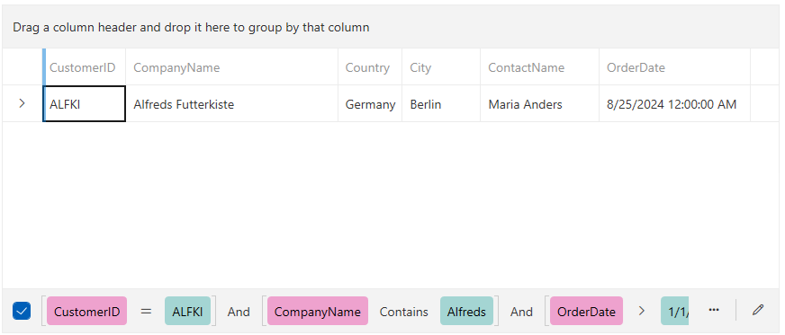
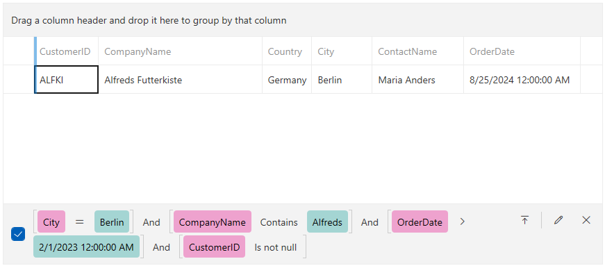

# Filter Editor

Filter Editor is one of the [filtering modes]() of RadGridView, which allows you to create complex filter expressions. The visualization of the editor consists of a panel displaying an overview of the filtering criterias and a dialog with embedded [RadDataFilter]() control that is used to add, remove and modify the filters.

## Visual Structure

* __Data Filter View__&mdash;The panel displaying the applied filters and the related options.
* __Apply Filters CheckBox__&mdash;A CheckBox that enables/disables the selected filters in the associated RadGridView instances.
* __Toggle Wrapping Button__&mdash;A toggle button that enables/disables the wrapping of the filtering criterias.
* __Edit Filters Button__&mdash;A button that opens a dialog that allows editing of the filters using a `RadDataFilter` control.
* __Close Button__&mdash;A button that hides the Data Filter View panel.
* __Filter Part__&mdash;The parts of the field criterias, the associated operators and parenting.
* __RadDataFilter__&mdash;A data filter editor.

## Enabling the Filter Editor

To show the __Data Filter View__ panel, set the [FilteringMode property]() of `RadGridView` to `FilterEditor`. Additional to that the following Telerik assemblies needs to be referenced in the project.

* `Telerik.Windows.Controls.Data.dll`
* `Telerik.Windows.Controls.Navigation.dll`

#### __[XAML] Enabling the filter editor__
{{region gridview-filter-editor-0}}
	<telerik:RadGridView FilteringMode="FilterEditor"/>
{{endregion}}

The panel can be hidden with the __Close Button__. To return it back, invoke the `RadGridViewCommands.ToggleFilterEditor` command, or alternatively use the [column headers context menu](#toggling-the-filter-editor-panel-visibility).

## Filter Editor Position

The editor is positioned at the bottom of the data grid component, but this can be changed with the `FilterEditorPosition` property of `RadGridView`. The available positions are `Top` and `Bottom` (default).

#### __[XAML] Setting the filter editor position__
{{region gridview-filter-editor-1}}
	<telerik:RadGridView FilteringMode="FilterEditor" FilterEditorPosition="Top"/>
{{endregion}}

__Top positioned filter editor panel__  

## Toggling the Filters

The filters can be enabled or disabled with the __Apply Filters CheckBox__. Deselecting the CheckBox will disable the filters and update the RadGridView's data view accordingly.

__Enable/disable filters check box__

## Toggling the Filter Editor Panel Visibility

The panel can be hidden with the `RadGridViewCommands.ToggleFilterEditor` command and the __Close Button__.

#### __[C#] Executing the RadGridViewCommands.ToggleFilterEditor command__
{{region gridview-filter-editor-2}}
	this.gridView.PendingCommands.Add(RadGridViewCommands.ToggleFilterEditor);
	this.gridView.ExecutePendingCommand();
{{endregion}}

Additional to that, the panel can be shown and hidden with the column headers context menu. This is a menu displayed on mouse right click over any column header. To enable the menu set the `EnableHeaderContextMenu` property of `RadGridView` to `true`.

#### __[XAML] Enabling the column header context menu__
{{region gridview-filter-editor-3}}
	<telerik:RadGridView EnableHeaderContextMenu="True" FilteringMode="FilterEditor" />
{{endregion}}

__Column header context menu__

## Removing Filters on Panel Close

By default closing the panel (with the close button or the command), won't clear the applied filters. To change this behavior and clear the filters, set the `ShouldRemoveFiltersOnClose` property of `RadDataFilterView` to `True`.

#### __[XAML] Setting the ShouldRemoveFiltersOnClose property__
{{region gridview-filter-editor-4}}
	<telerik:RadGridView FilteringMode="FilterEditor">
		<telerik:RadGridView.Resources>
			<!-- Add the following setting to the Style tag if using the Telerik NoXaml dlls: -->
			<!--BasedOn="{StaticResource RadDataFilterViewStyle}"-->
			
		</telerik:RadGridView.Resources>
	</telerik:RadGridView>
{{endregion}}

## No Filters Content

The message displayed when no filters are applied can be customized with the `EmptyFiltersContent` and `EmptyFiltersContentTemplate` properties of `RadDataFilterView`.

#### __[XAML] Setting the EmptyFiltersContent property__
{{region gridview-filter-editor-5}}
	<telerik:RadGridView FilteringMode="FilterEditor">
		<telerik:RadGridView.Resources>
			<!-- Add the following setting to the Style tag if using the Telerik NoXaml dlls -->
			<!--BasedOn="{StaticResource RadDataFilterViewStyle}"-->
			    
		</telerik:RadGridView.Resources>
	</telerik:RadGridView>
{{endregion}}

__Changed default empty filters text__

#### __[XAML] Setting the EmptyFiltersContentTemplate property__
{{region gridview-filter-editor-6}}
	<telerik:RadGridView FilteringMode="FilterEditor">
		<telerik:RadGridView.Resources>
			<!-- Add the following setting to the Style tag if using the Telerik NoXaml dlls -->
			<!--BasedOn="{StaticResource RadDataFilterViewStyle}"-->
			    
		</telerik:RadGridView.Resources>
	</telerik:RadGridView>
{{endregion}}

__Changed default empty filters visual__

## Commands

The filter editor feature provides the following set of commands that can be utilized.

* `RadGridViewCommands.ToggleFilterEditor`&mdash;Hides and shows the filter editor view.
* `FilterEditorDialogCommands.SelectFilters`&mdash;Applies the selection in the filter editor dialog and closes it.
* `FilterEditorDialogCommands.CancelFilters`&mdash;Cancels the selection in the filter editor dialog and closes it.
* `FilterEditorDialogCommands.ApplyFilters`&mdash;Applies the selection in the filter editor dialog without closing it.
* `RadDataFilterViewCommands.OpenFilterEditor`&mdash;Opens the filter editor dialog.
* `RadDataFilterViewCommands.ToggleWrapping`&mdash;Toggles the [filter criterias wrapping](#customizing-filter-editor-parts).

## Events

The `RadDataFilterView` control exposes several properties of type `EventHandler` that can be used to assign handlers invoked when specific actions in the `RadDataFilter` control occur.

The `FilterOperatorsLoadingHandler` property allows to set a handler of type `EventHandler<FilterOperatorsLoadingEventArgs>` that is invoked when the filter operators starts loading. This allows you to remove operators from the collection with the available operators.

The `EditorCreatedHandler` property allows to set a handler of type `EventHandler<EditorCreatedEventArgs>` that is invoked when the filter starts loading. This allows you to remove operators from the collection with the available operators.

The `AutoGeneratingItemPropertyDefinitionHandler` property allows to set a handler of type `EventHandler<DataFilterAutoGeneratingItemPropertyDefinitionEventArgs>` that is invoked when the filter operators starts loading. This allows you to remove operators from the collection with the available operators.

#### __[C#] Assigning the handler objects in code behind__
{{region gridview-filter-editor-7}}
	private void RadGridView_Loaded(object sender, RoutedEventArgs e)
	{
		var gridView = (RadGridView)sender;
		var dataFilterView = gridView.FindChildByType<RadDataFilterView>();
		dataFilterView.FilterOperatorsLoadingHandler = new EventHandler<Telerik.Windows.Controls.Data.DataFilter.FilterOperatorsLoadingEventArgs>(OnFilterOperatorsLoading);
		dataFilterView.EditorCreatedHandler = new EventHandler<Telerik.Windows.Controls.Data.DataFilter.EditorCreatedEventArgs>(OnEditorCreated);
		dataFilterView.AutoGeneratingItemPropertyDefinitionHandler = new EventHandler<Telerik.Windows.Controls.Data.DataFilter.DataFilterAutoGeneratingItemPropertyDefinitionEventArgs>(OnAutoGeneratingItemPropertyDefinition);
	}
{{endregion}}

#### __[XAML] Defining a handler property in a view model__
{{region gridview-filter-editor-8}}
	public EventHandler<Telerik.Windows.Controls.Data.DataFilter.FilterOperatorsLoadingEventArgs> MyEditorCreatedHandler { get; set; }
{{endregion}}

#### __[XAML] Assigning the handler object with data binding__
{{region gridview-filter-editor-9}}
	<telerik:RadGridView FilteringMode="FilterEditor">
		<telerik:RadGridView.Resources>
			<!-- Add the following setting to the Style tag if using the Telerik NoXaml dlls -->
			<!--BasedOn="{StaticResource RadDataFilterViewStyle}"-->
			    
		</telerik:RadGridView.Resources>
	</telerik:RadGridView>
{{endregion}}

#### __[C#] Defining event handlers__
{{region gridview-filter-editor-10}}
	private void OnAutoGeneratingItemPropertyDefinition(object? sender, DataFilterAutoGeneratingItemPropertyDefinitionEventArgs e)
	{
		if (e.ItemPropertyDefinition.PropertyType == typeof(DateTime))
		{
			e.Cancel = true;
		}
	}

	private void OnEditorCreated(object? sender, Telerik.Windows.Controls.Data.DataFilter.EditorCreatedEventArgs e)
	{
		if (e.ItemPropertyDefinition.PropertyName == "MyTitlesCollection")
		{
			var editor = (RadComboBox)e.Editor;
			//editor.ItemsSource = this.GetMyCustomTitlesCollection();
		}
	}

	private void OnFilterOperatorsLoading(object? sender, Telerik.Windows.Controls.Data.DataFilter.FilterOperatorsLoadingEventArgs e)
	{
		if (e.ItemPropertyDefinition.PropertyType == typeof(double))
		{
			e.AvailableOperators.RemoveAt(2);                
			e.DefaultOperator = Telerik.Windows.Data.FilterOperator.IsEqualTo;
		}
		
	}
{{endregion}}

The handler objects are propagated to the [RadDataFilter events]() with the same names - FilterOperatorsLoading, EditorCreated and AutoGeneratingItemPropertyDefinition.

## Customizing Filter Editor Parts

The filter editor elements can be customized with several properties exposed by the `RadDataFilterView` control.

To __change the spacing__ between the filter criteria visuals, set the `FilterPartsSpacing` property.

#### __[XAML] Setting the FilterPartsSpacing__
{{region gridview-filter-editor-11}}
	<telerik:RadGridView FilteringMode="FilterEditor">
		<telerik:RadGridView.Resources>
			<!-- Add the following setting to the Style tag if using the Telerik NoXaml dlls -->
			<!--BasedOn="{StaticResource RadDataFilterViewStyle}"-->
			    
		</telerik:RadGridView.Resources>
	</telerik:RadGridView>
{{endregion}}

__Increased spacing between the filter parts__

To __hide the close button__, set the `CloseButtonVisibility` property to `Collapsed`.

#### __[XAML] Setting the CloseButtonVisibility__
{{region gridview-filter-editor-12}}
	<telerik:RadGridView FilteringMode="FilterEditor">
		<telerik:RadGridView.Resources>
			<!-- Add the following setting to the Style tag if using the Telerik NoXaml dlls -->
			<!--BasedOn="{StaticResource RadDataFilterViewStyle}"-->
			    
		</telerik:RadGridView.Resources>
	</telerik:RadGridView>
{{endregion}}

__Hidden close button__  

To __change the layout behavior__ of the panel that displays the filtering criterias, change the `IsWrappingEnabled` property. By default, when the criteria visuals go outside of the available width, they will get clipped. Setting `IsWrappingEnabled` to `true` will wrap the visuals and display them on multiple rows. 

#### __[XAML] Enabling wrapping__
{{region gridview-filter-editor-13}}
	<telerik:RadGridView FilteringMode="FilterEditor">
		<telerik:RadGridView.Resources>
			<!-- Add the following setting to the Style tag if using the Telerik NoXaml dlls -->
			<!--BasedOn="{StaticResource RadDataFilterViewStyle}"-->
			    
		</telerik:RadGridView.Resources>
	</telerik:RadGridView>
{{endregion}}

__Wrapped filter parts__  

The wrapping behavior can be enabled and disabled also with the __Toggle Wrapping Button__. When there is enough width to display all filtering criterias the button won't be displayed and the `CanToggleWrapping` property of `RadDataFilterView` will return `false`.

To __change the default size of the dialog__ with the `RadDataFilter` control, set the `FilterEditorWindowWidth` and `FilterEditorWindowHeight` properties of `RadDataFilterView`.

#### __[XAML] Setting the filter editor dialog size__
{{region gridview-filter-editor-14}}
	<telerik:RadGridView FilteringMode="FilterEditor">
		<telerik:RadGridView.Resources>
			<!-- Add the following setting to the Style tag if using the Telerik NoXaml dlls -->
			<!--BasedOn="{StaticResource RadDataFilterViewStyle}"-->
			    
		</telerik:RadGridView.Resources>
	</telerik:RadGridView>
{{endregion}}

__Filter editor dialog with customized size__

## Customizing Filtering Criteria Visuals

The filtering criteria visuals are represented by the `FilterPart` element. To apply custom settings to this visual, an implicit style defined in the `RadGridView.Resources` can be used.

To change the member and value backgrounds, set the `MemberBackground` and `ValueBackground` properties of `FilterPart`.

#### __[XAML] Setting the backgrounds of the member and value filter parts__
{{region gridview-filter-editor-15}}
	<telerik:RadGridView FilteringMode="FilterEditor">
		<telerik:RadGridView.Resources>
			<!-- Add the following setting to the Style tag if using the Telerik NoXaml dlls -->
			<!--BasedOn="{StaticResource FilterPartStyle}"-->
			    
		</telerik:RadGridView.Resources>
	</telerik:RadGridView>
{{endregion}}

__Customized FilterPart member and value backgrounds__  

The `FilterPart` can be further customized by setting its `ContentTemplate` property.

#### __[XAML] Customizing the FilePart elements using the ContentTemplate__
{{region gridview-filter-editor-16}}
	<telerik:RadGridView.Resources>
		<!-- Add the following setting to the Style tag if using the Telerik NoXaml dlls -->
		<!--BasedOn="{StaticResource FilterPartStyle}"-->
		
	</telerik:RadGridView.Resources>	
{{endregion}}

__Customized FilterPart content__  

The data context in the `ContentTemplate` is an object of type `FilterPartViewModel` which contains the following information:

* `Type`&mdash;This is the type of part's content represented by the `FilterPartType` enum. It can be a `LogicalOperator`, `Operator`, `Member`, `Value`, `OpeningBracket` or `ClosingBracket`.
* `Content`&mdash;This is the content that will be displayed in the content area. It can be an operator name (And, Or, StartsWith, Contains, etc.), member (property name), value or a opening/closing bracket.

The view model gives information also for the current level of the filtering part in the composite filter's hierarchy through the `Level` property. 
