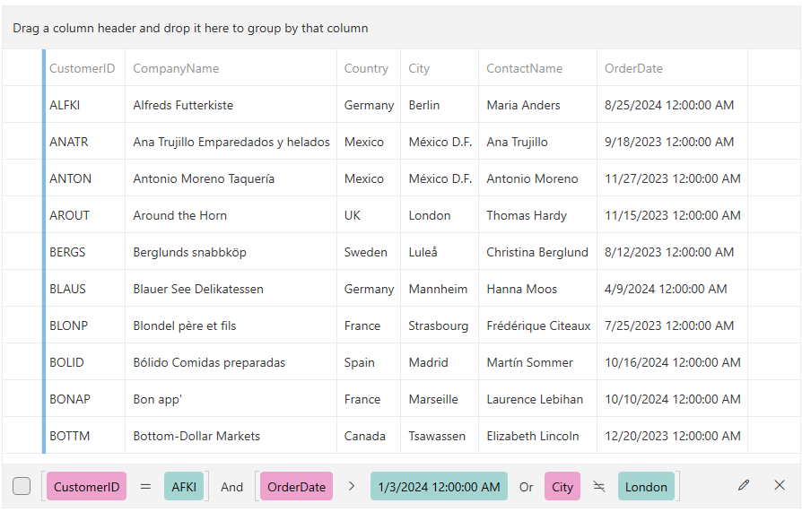

# Configure The Filtering Mode

RadGridView has three filtering modes as described in the [Filtering Basics]() article.

## Popup Filtering

To enable the popup filtering mode, set RadGridView’s `FilteringMode` property to `Popup` or do not set anything, since this is the standard default filtering mode.

#### __XAML__ 
{{region xaml-gridview-filtering-howto-configure-the-filtering-mode_0}}
	<telerik:RadGridView FilteringMode="Popup" />
{{endregion}}

__Popup Filtering Mode__  

## Filter Row

To enable the filter row mode, set RadGridView’s `FilteringMode` property to `FilterRow`.

#### __XAML__  
{{region xaml-gridview-filtering-howto-configure-the-filtering-mode_1}}
	<telerik:RadGridView FilteringMode="FilterRow" />
{{endregion}}

__FilterRow Filtering Mode__  

## Filter Editor

To enable the filter editor mode, set RadGridView’s `FilteringMode` property to `FilterEditor`.

#### __XAML__  
{{region xaml-gridview-filtering-howto-configure-the-filtering-mode_2}}
	<telerik:RadGridView FilteringMode="FilterEditor" />
{{endregion}}

__FilterEditor Filtering Mode__  

