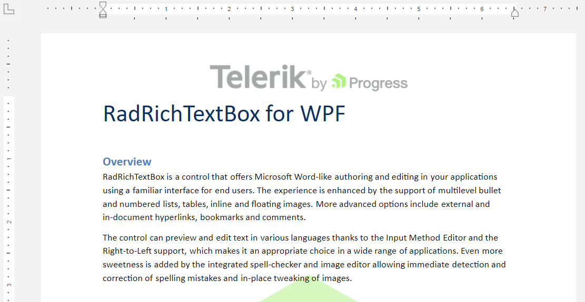
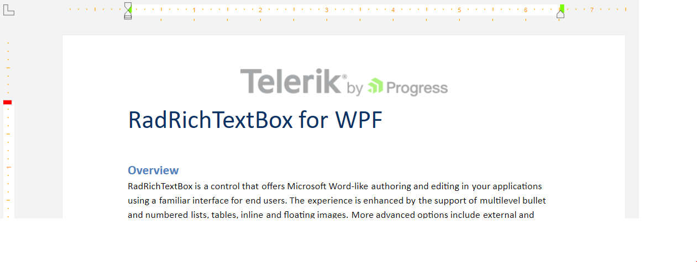
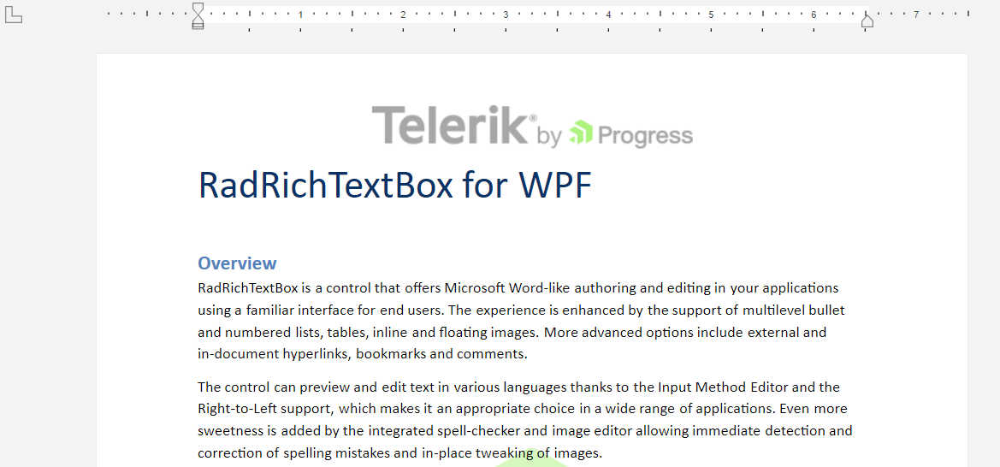

# Document Ruler

The `DocumentRuler` element allows you to visualize a guide that will assist you in aligning text, tables, graphics, and other elements via the thumbs of the horizontal and vertical rulers. To display the document ruler, wrap it around a `RadRichTextBox` instance.

#### __[XAML] Displaying the DocumentRuler__
{{region radrichtextbox-features-document-ruler-0}}
    <telerik:DocumentRuler>
        <telerik:RadRichTextBox Name="radRichTextBox" />
    </telerik:DocumentRuler>
{{endregion}}

__RadRichTextBox with DocumentRuler__

## Customizing the Appearance of the Document Ruler

The DocumentRuler object derives from the `DocumentRulerBase` class, which exposes the following API for customizing the appearance:

* `ThumbBackgroundStyle`&mdash;This property provides the functionality to set a `Style` for the background thumbs.
* `VerticalThumbStyle`&mdash;Gets or sets a `Style` the vertical thumb.
* `HorizontalThumbStyle`&mdash;Gets or sets a `Style` for the horizontal thumb.
* `MarkersBrush`&mdash;Allows you to specify a value of the type of `Brush` for the markers of the vertical and horizontal rulers.
* `MeasurementUnit`&mdash;Allows you to specify the unit used for measurement. The property is of the type of `UnitTypes` and provides the following options:
  * `DIP`   
  * `Point`
  * `Pica`
  * `Inch`
  * `Mm`
  * `Cm`
  * `Twip`
* `SectionColumnThumbStyle`&mdash;This property provides the functionality to specify a style for the section column thumb.
* `TableColumnThumbStyle`&mdash;This property allows you to specify a style for the table column thumb.
* `DefaultRulerThumbType`&mdash;This property provides you with the ability to set a style for the default ruler thumb.

#### __[XAML] Customizing the Appearance of the Document Ruler__
{{region radrichtextbox-features-document-ruler-1}}
    <telerik:DocumentRuler MarkersBrush="Orange">
        <telerik:DocumentRuler.VerticalThumbStyle>
            
        </telerik:DocumentRuler.VerticalThumbStyle>
        <telerik:DocumentRuler.HorizontalThumbStyle>
            
        </telerik:DocumentRuler.HorizontalThumbStyle>
        <telerik:RadRichTextBox Name="radRichTextBox" IsSpellCheckingEnabled="False"/>
    </telerik:DocumentRuler>
{{endregion}}

__Customized appearance of the DocumentRuler element__

## Hiding Vertical/Horizontal Ruler of the Document Ruler

You can change the visibility of the vertical/horizontal ruler of the DocumentRuler control. To do so, you can utilize its `CreateHorizontalRuler` and `CreateVerticalRuler` properties. These properties will be taken into account if the DocumentRuler instance has been loaded.

#### __[C#] Hiding the vertical ruler of the DocumentRuler__
{{region radrichtextbox-features-document-ruler-2}}
    private void DocumentRuler_Loaded(object sender, RoutedEventArgs e)
    {
        this.documentRuler.CreateVerticalRuler = false;   
    }
{{endregion}}

__DocumentRuler with hidden vertical ruler__

## Read-Only Support

The DocumentRuler control exposes the `IsReadOnly` property. You can use it to prevent/allow the user to make changes to the document via the vertical and horizontal rulers. This property will be taken into account if the DocumentRuler control has been loaded.

#### __[C#] Setting the IsReadOnly property__
{{region radrichtextbox-features-document-ruler-2}}
    private void DocumentRuler_Loaded(object sender, RoutedEventArgs e)
    {
        this.documentRuler.IsReadOnly = true;   
    }
{{endregion}}

## Customizing the Behavior of the DocumentRuler

You can customize the DocumentRuler's behavior by providing a custom implementation for the [IDocumentRulerController](https://docs.telerik.com/devtools/wpf/api/telerik.windows.controls.richtextboxui.idocumentrulercontroller) interface to the `Controller` property. You can either create your own implementation of this interface or extend the default [RadRichTextBoxRulerController](https://docs.telerik.com/devtools/wpf/api/telerik.windows.controls.richtextboxui.radrichtextboxrulercontroller) class.

## See Also
* [TabStop](#raddocumenteditor-methods)
* [Section Columns]()