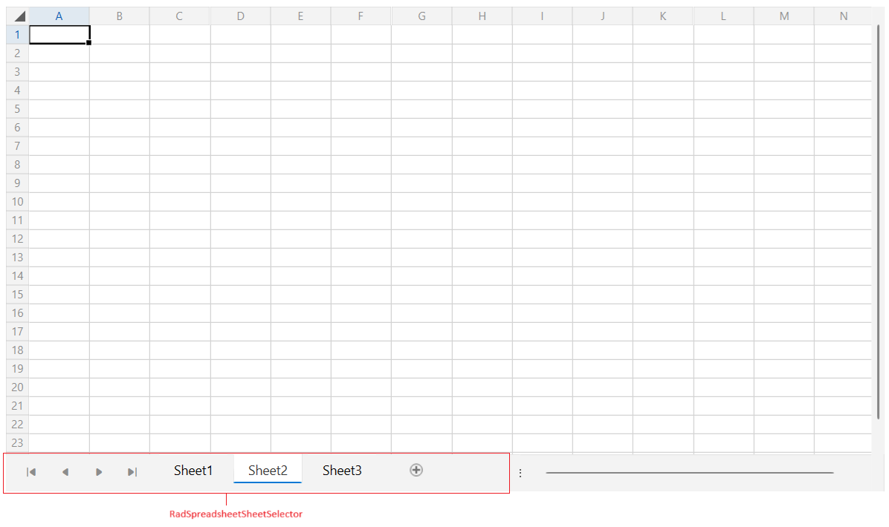
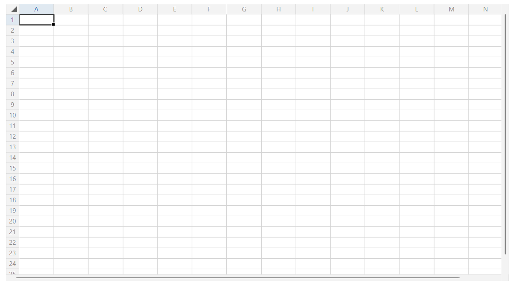
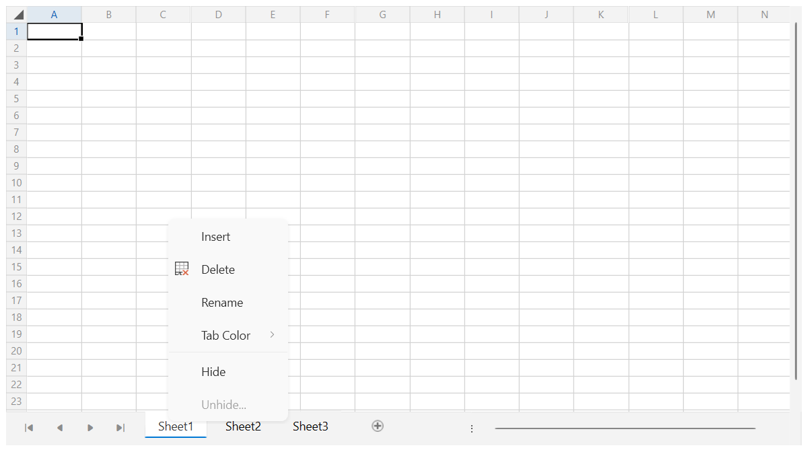

# Sheet Selector

The [sheet selector](#radspreadsheet-visual-structure) is a pager displayed under the spreadsheet document that allows you to switch between the different [worksheets]().

The sheet selector is represented by the `RadSpreadsheetSheetSelector` control, which is integrated in the ControlTemplate of the `RadSpreadsheet`. This article describes how to access and customize the selector.

The `RadSpreadsheetSheetSelector` control is located in the `Telerik.Windows.Controls.Spreadsheet.Controls` namespace. To access it in XAML, use the following namespace: `xmlns:spreadsheetControls="clr-namespace:Telerik.Windows.Controls.Spreadsheet.Controls;assembly=Telerik.Windows.Controls.Spreadsheet" `

## Hiding the Sheet Selector

By default the sheet selector component is displayed. To hide it, set the `RadSpreadsheetSheetSelector.IsSheetSelectorVisible` [attached property](https://learn.microsoft.com/en-us/dotnet/desktop/wpf/properties/attached-properties-overview?view=netdesktop-9.0) on the `RadSpreadsheet` control to `false`.

#### __[XAML] Setting the IsSheetSelectorVisible property__
{{region radspreadsheet-sheet-selector-0}}
	<telerik:RadSpreadsheet spreadsheetControls:RadSpreadsheetSheetSelector.IsSheetSelectorVisible="False"/>
{{endregion}}

__RadSpreadsheet with hidden sheet selector__  

## Hiding the Add Sheet Button

By default the sheet selector has a button displayed next to the worksheeet tabs that allows to add new worksheets in the document. To hide the button, set the `RadSpreadsheetSheetSelector.IsAddButtonVisible` [attached property](https://learn.microsoft.com/en-us/dotnet/desktop/wpf/properties/attached-properties-overview?view=netdesktop-9.0) on the `RadSpreadsheet` control to `false`.

#### __[XAML] Setting the IsAddButtonVisible property__
{{region radspreadsheet-sheet-selector-1}}
	<telerik:RadSpreadsheet spreadsheetControls:RadSpreadsheetSheetSelector.IsAddButtonVisible="False"/>
{{endregion}}

__RadSpreadsheet with hidden add button__  

## Using the Tabs Context Menu

The worksheet tabs in the `RadSpreadsheetSheetSelector` have a built-in context menu which allows you to apply few different settings on the tab - rename, insert, delete, hide, etc.

__Sheet selector's context menu__  

The context menu can be modified or accessed via the `SheetSelectorContextMenu` property of `RadSpreadsheet`.

#### __[C#] Customizing the existing context menu__
{{region radspreadsheet-sheet-selector-1}}
	private void RadSpreadsheet_Loaded(object sender, RoutedEventArgs e)
	{
		var spreadsheet = (RadSpreadsheet)sender;
		
		// remove the last two options
		spreadsheet.SheetSelectorContextMenu.Items.RemoveAt(spreadsheet.SheetSelectorContextMenu.Items.Count - 1);
		spreadsheet.SheetSelectorContextMenu.Items.RemoveAt(spreadsheet.SheetSelectorContextMenu.Items.Count - 1);

		// add a new option
		var newMenuItem = new RadMenuItem();
		newMenuItem.Header = "My option";
		newMenuItem.Click += (s, args) =>
		{
			// implement the click logic here
		};
		spreadsheet.SheetSelectorContextMenu.Items.Add(newMenuItem);
	}
{{endregion}}

#### __[XAML] Replacing the context menu__
{{region radspreadsheet-sheet-selector-1}}
	<telerik:RadSpreadsheet>
		<telerik:RadSpreadsheet.SheetSelectorContextMenu>
			<telerik:RadContextMenu>
				<telerik:RadMenuItem Header="Option A" Click="OnOptionAClick"/>
				<telerik:RadMenuItem Header="Option B" Click="OnOptionBClick"/>
			</telerik:RadContextMenu>
		</telerik:RadSpreadsheet.SheetSelectorContextMenu>
	</telerik:RadSpreadsheet>
{{endregion}}

Additional to that, the menu can be accessed with the `GetContextMenu` and `SetContextMenu` methods of `RadSpreadsheetSheetSelector`.

#### __[C#] Using the GetContextMenu and SetContextMenu methods__
{{region radspreadsheet-sheet-selector-1}}
	private void RadSpreadsheet_Loaded(object sender, RoutedEventArgs e)
	{
		var spreadsheet = (RadSpreadsheet)sender;
		var sheetSelector = spreadsheet.FindChildByType<RadSpreadsheetSheetSelector>();

		// getting the menu
		RadContextMenu contextMenu = sheetSelector.GetContextMenu();

		// setting the menu
		sheetSelector.SetContextMenu(newRadContextMenuInstance);
	}
{{endregion}}