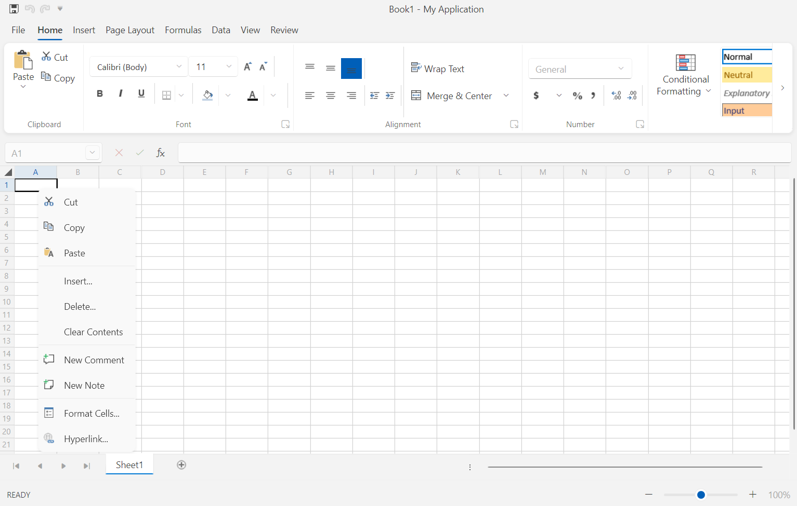
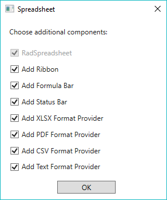
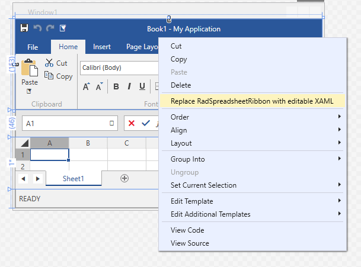

# Spreadsheet UI

RadSpreadsheet comes with pre-defined UI that is automatically wired with all of the commands provided by the control and shows its full potential. **RadSpreadsheetRibbon** automatically registers the UI components of **RadSpreadsheet** and keeps them up-to-date after each upgrade.

#### Figure 1: RadSpreadsheet with default UI and context menu

## Add RadSpreadsheet with Predefined UI to Your Application

**RadSpreadsheetRibbon** control compliments **RadSpreadsheet**, with convenient ribbon exposing the variety of features the latter supports. With few lines of XAML you get all the UI expected from a standard spreadsheet editing application, including multiple ribbon tabs full of commands, styles gallery, formula and status bar. When updating from version to version, you'll automatically get UI for all the new commands we expose.

After dragging the **RadRadSpreadsheet** control from the Toolbox to the Designer of Visual Studio, you will be prompted to choose the UI components you would like to use in your application. The available options are as follows:

>This functionality is available since R1 2018 and supported in Visual Studio 2012 and later versions.

* **Add Ribbon**

* **Add Formula Bar**

* **Add Status Bar**

	> The different visual elements of RadSpreadsheet are described in the [Visual Structure]() help article.

* **Add XLSX Format Provider**: Registers the [**XlsxFormatProvider**](https://docs.telerik.com/devtools/document-processing/libraries/radspreadprocessing/formats-and-conversion/xlsx/xlsxformatprovider) in the **FormatProviders** collection of RadSpreadsheet.

* **Add PDF Format Provider**: Registers the [**PdfFormatProvider**](https://docs.telerik.com/devtools/document-processing/libraries/radspreadprocessing/formats-and-conversion/pdf/pdfformatprovider) in the **FormatProviders** collection of RadSpreadsheet.

* **Add CSV Format Provider**: Registers the [**CsvFormatProvider**](https://docs.telerik.com/devtools/document-processing/libraries/radspreadprocessing/formats-and-conversion/csv/csvformatprovider) in the **FormatProviders** collection of RadSpreadsheet.

* **Add Text Format Provider**: Registers the [**TxtFormatProvider**](https://docs.telerik.com/devtools/document-processing/libraries/radspreadprocessing/formats-and-conversion/txt/txtformatprovider) in the **FormatProviders** collection of RadSpreadsheet.

	> More information about the **FormatProviders** property of **RadSpreadsheet** is available in the [Import/Export]() topic.

#### Figure 2: Choose the components you would like to use

**Example 1** shows how the XAML generated after enabling all options looks like.

#### [XAML] Example 1: Default Look

{{region radspreadsheet-getting-started-spreadsheet-ui_0}}

	<Grid x:Name="spreadsheetLayoutRoot">
	    <Grid.RowDefinitions>
	        <RowDefinition Height="Auto"/>
	        <RowDefinition Height="Auto"/>
	        <RowDefinition/>
	        <RowDefinition Height="Auto"/>
	    </Grid.RowDefinitions>
	    <telerik:RadSpreadsheetRibbon BackstageClippingElement="{Binding ElementName=spreadsheetLayoutRoot, Mode=OneTime}" RadSpreadsheet="{Binding ElementName=radSpreadsheet, Mode=OneTime}"/>
	    <Controls:RadSpreadsheetFormulaBar Grid.Row="1" RadSpreadsheet="{Binding ElementName=radSpreadsheet, Mode=OneTime}"/>
	    <telerik:RadSpreadsheet x:Name="radSpreadsheet" Grid.Row="2">
	        <telerik:RadSpreadsheet.FormatProviders>
	            <Txt:TxtFormatProvider/>
	            <Csv:CsvFormatProvider/>
	            <Pdf:PdfFormatProvider/>
	            <Xlsx:XlsxFormatProvider/>
	        </telerik:RadSpreadsheet.FormatProviders>
	    </telerik:RadSpreadsheet>
	    <Controls:RadSpreadsheetStatusBar Grid.Row="3" RadSpreadsheet="{Binding ElementName=radSpreadsheet, Mode=OneTime}"/>
	</Grid>
{{endregion}}

To build the code from **Example 1**, you should add the following namespaces:

#### Namespaces

#### __XAML__

{{region radspreadsheet-getting-started-spreadsheet-ui_1}}

	xmlns:telerik="http://schemas.telerik.com/2008/xaml/presentation" 
    xmlns:Controls="clr-namespace:Telerik.Windows.Controls.Spreadsheet.Controls;assembly=Telerik.Windows.Controls.Spreadsheet" 
    xmlns:Txt="clr-namespace:Telerik.Windows.Documents.Spreadsheet.FormatProviders.TextBased.Txt;assembly=Telerik.Windows.Documents.Spreadsheet"
    xmlns:Csv="clr-namespace:Telerik.Windows.Documents.Spreadsheet.FormatProviders.TextBased.Csv;assembly=Telerik.Windows.Documents.Spreadsheet" 
    xmlns:Pdf="clr-namespace:Telerik.Windows.Documents.Spreadsheet.FormatProviders.Pdf;assembly=Telerik.Windows.Documents.Spreadsheet.FormatProviders.Pdf"
    xmlns:Xlsx="clr-namespace:Telerik.Windows.Documents.Spreadsheet.FormatProviders.OpenXml.Xlsx;assembly=Telerik.Windows.Documents.Spreadsheet.FormatProviders.OpenXml" 
    
{{endregion}}

### Customizing the Template of RadSpreadsheetRibbon

When you would like to change the way **RadSpreadsheetRibbon** looks like, or add custom functionality to it, you can extract its template. This can be achieved through the **Replace RadSpreadsheetRibbon with Editable XAML** option of the Visual Studio Designer's context menu.

#### Figure 4: Replace RadSpreadsheetRibbon with Editable XAML option of the Visual Studio Designer's context menu

> Note that in this scenario, the RadSpreadsheetRibbon is replaced by its XAML code. Doing this, you will not be able to receive updates for the control and will not be able to take advantage of the styling functionalities. 

### Customizing the Template of the Default Context Menu

Extracting the template of the default context menu can be done using a pretty similar approach to the one described for RadSpreadsheetRibbon. Just right-click on RadSpreadsheet in the designer of Visual Studio and choose **Replace Default Context Menu with Editable XAML**.

You can also disable the default Context Menu or replace it with a custom implementation.

#### [XAML] Example 2: Disable Context Menu

{{region radspreadsheet-getting-started-spreadsheet-ui_2}}

	<telerik:RadSpreadsheet x:Name="radSpreadsheet">
	    <telerik:RadSpreadsheet.WorksheetEditorContextMenu>
	        <x:Null/>
	    </telerik:RadSpreadsheet.WorksheetEditorContextMenu>
	</telerik:RadSpreadsheet>
{{endregion}}

#### [C#] Example 2: Disable Context Menu

{{region radspreadsheet-getting-started-spreadsheet-ui_3}}

	this.radSpreadsheet.WorksheetEditorContextMenu = null;
{{endregion}}

#### [VB.NET] Example 2: Disable Context Menu

{{region radspreadsheet-getting-started-spreadsheet-ui_4}}

	Me.radSpreadsheet.WorksheetEditorContextMenu = Nothing
{{endregion}}

## See Also

* [Getting Started with RadSpreadsheet]()
* [Visual Structure]()
* [Import/Export]()