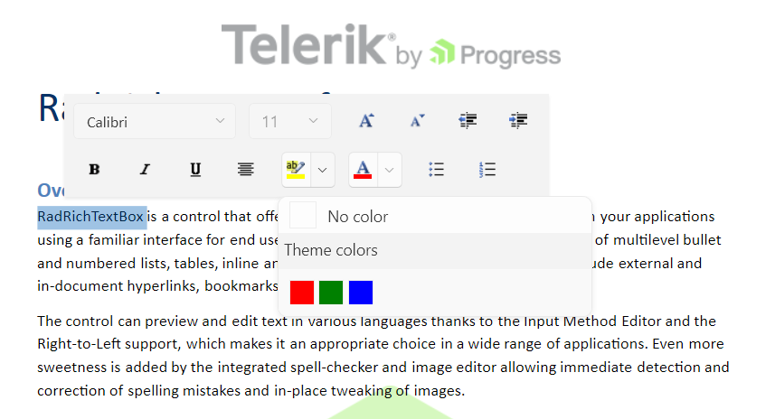

## Environment

<table>
	<tbody>
		<tr>
			<td>Product Version</td>
			<td>2024.2.514</td>
		</tr>
		<tr>
			<td>Product</td>
			<td>RadRichTextBox for WPF</td>
		</tr>
	</tbody>
</table>

## Description

The highlight colors that the RadRichTextBox control provides differ from the ones that are present in Microsoft Word. This cause the DOCX format to not use these additional colors when exporting a paragraph. 

## Solution

Change the colors of the color picker in the selection mini toolbar of the RadRichTextBox control. To do so, create a custom `SelectionMiniToolBar` and override the `OnApplyTemplate` method. In it, you can customize the colors of the `MainPaletteItemsSource` property of the `HighlightColorPicker` element.

The following example showcases this approach for a __.NET Framework__ project. It will utilize the `CustomSelectionMiniToolBar` attribute, which the [MEF support]() will read and use this custom implementation:

#### __[C#] Custom SelectionMiniToolBar for a .NET Framework project__
{{region kb-radrichtextbox-difference-in-the-highlighted-colors-0}}
    [CustomSelectionMiniToolBar]
    public class CustomSelectionMiniToolBar : SelectionMiniToolBar
    {
        public override void OnApplyTemplate()
        {
            // It is mandatory to call the base OnApplyTemplate.
            base.OnApplyTemplate();

            this.SetHighlightColorPallete();
        }

        private void SetHighlightColorPallete()
        {
            List<Color> colors = new List<Color>
            {
                Colors.Red,
                Colors.Green,
                Colors.Blue
            };

            this.HighlightColorPicker.HeaderPaletteVisibility = System.Windows.Visibility.Hidden;
            this.HighlightColorPicker.StandardPaletteVisibility = System.Windows.Visibility.Hidden;

            this.HighlightColorPicker.MainPaletteItemsSource = colors;

        }
    }
{{endregion}}

The following example showcases this approach for a __.NET__ project. Since the MEF functionality is no longer supported by the __.NET 6 and later versions__, set a new instance of the `CustomSelectionMiniToolBar` element to the `SelectionMiniToolBar` property of `RadRichTextBox`. 

#### __[C#] Custom SelectionMiniToolBar for a .NET project__  
{{region kb-radrichtextbox-difference-in-the-highlighted-colors-1}}
    //CustomSelectionMiniToolBar attribute is not present
    public class CustomSelectionMiniToolBar : SelectionMiniToolBar
    {
        public override void OnApplyTemplate()
        {
            // It is mandatory to call the base OnApplyTemplate.
            base.OnApplyTemplate();

            this.SetHighlightColorPallete();
        }

        private void SetHighlightColorPallete()
        {
            List<Color> colors = new List<Color>
            {
                Colors.Red,
                Colors.Green,
                Colors.Blue
            };

            this.HighlightColorPicker.HeaderPaletteVisibility = System.Windows.Visibility.Hidden;
            this.HighlightColorPicker.StandardPaletteVisibility = System.Windows.Visibility.Hidden;

            this.HighlightColorPicker.MainPaletteItemsSource = colors;

        }
    }
{{endregion}}

#### __[C#] Setting the custom SelectionMiniToolBar to the RadRichTextBox control__   
{{region kb-radrichtextbox-difference-in-the-highlighted-colors-2}}
	this.richTextBox.SelectionMiniToolBar = new CustomSelectionMiniToolBar(); 
{{endregion}}

__RadRichTextBox with a custom SelectionMiniToolBar__

